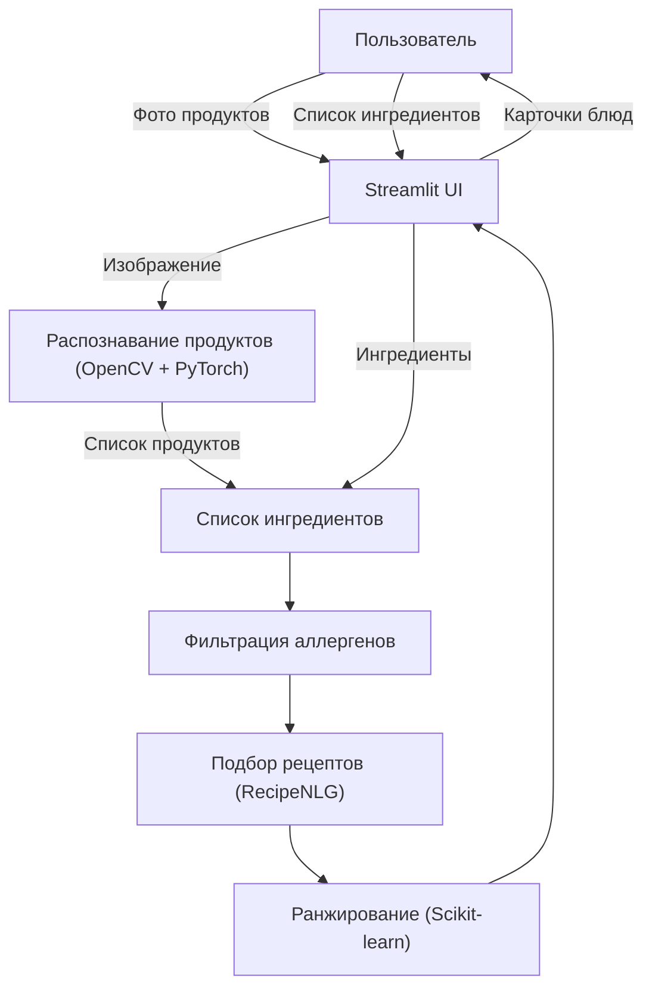

# Clever-Cooker
# 🍳 SmartCook - Умный Повар (AI Генератор Рецептов)

## 1. Описание проекта

### Title  
**SmartCook - Умный Повар (Генератор еды)**  

### Description  
Проект SmartCook решает проблему выбора блюд из доступных продуктов и учета индивидуальных ограничений пользователя.  

Основные задачи системы:  
- Генерация рецептов на основе имеющихся продуктов.  
- Фильтрация аллергенов (исключение опасных ингредиентов).  
- Детекция продуктов по изображению (что находится на столе).  
- Ранжирование рецептов по полезности и популярности.  
- Удобный пользовательский интерфейс с карточками блюд.  

Пользователь может загрузить фото продуктов или ввести список ингредиентов и получить персонализированные рекомендации блюд.

---

### Tech Stack  

Планируемый стек технологий:

**Backend / AI:**
- Python  
- PyTorch (модель классификации еды)  
- OpenCV (обработка изображений)  
- Scikit-learn (ранжирование и обработка данных)  

**NLP / Data Processing:**
- Pandas  
- NumPy  

**UI:**
- Streamlit (веб-интерфейс)  

**Datasets:**
- RecipeNLG Dataset  
  https://www.kaggle.com/datasets/saldenisov/recipenlg  
- Food-11 Image Classification Dataset  
  https://www.kaggle.com/datasets/imbikramsaha/food11  

**Дополнительно:**
- Git/GitHub (версионирование)  

---

## 2. Архитектурная схема проекта

Ниже представлена архитектура потоков данных системы SmartCook.

### Поток работы:

- Пользователь загружает фото продуктов или вводит список ингредиентов  
- Система распознаёт продукты  
- Выполняется фильтрация аллергенов  
- Подбираются рецепты  
- Выполняется ранжирование  
- Пользователь получает карточки блюд  

### Схема (Mermaid.js)

